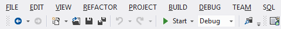
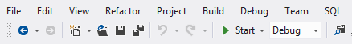
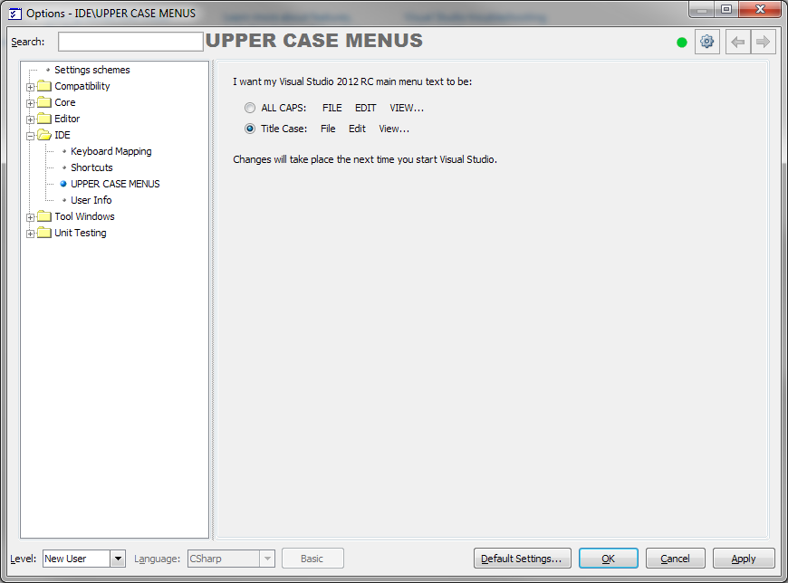

# 'Upper Case Menu Control' for CodeRush #
A simple plugin which allows one to reverse the ALL CAPS nature of VS2012 RC's main menus.

This allows you to change the VS2012 RC menus from...

...To...

### Usage ###
  * Visit **DevExpress\Options** ... 
  * Locate **IDE\UPPER CASE MENUS**
  * Choose either '**ALL CAPS**' or '**Title Case**'
  * Click OK.
  * Note: You will need to restart Visual Studio for this setting to take effect.

